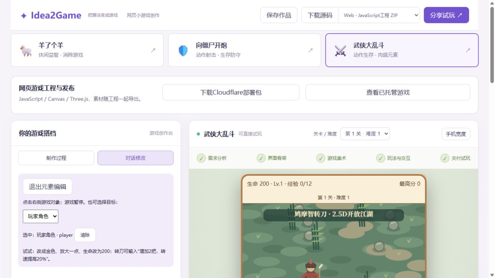
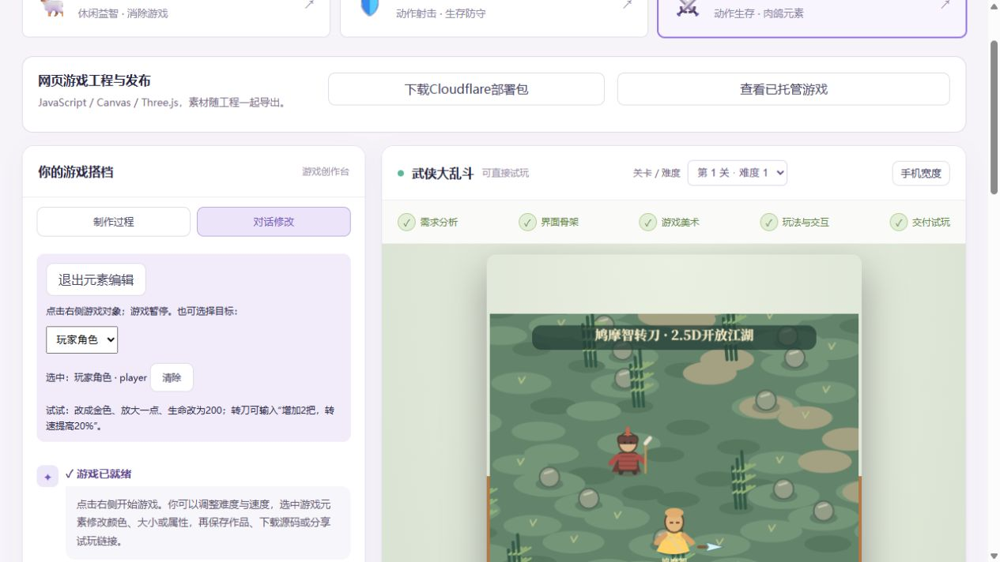
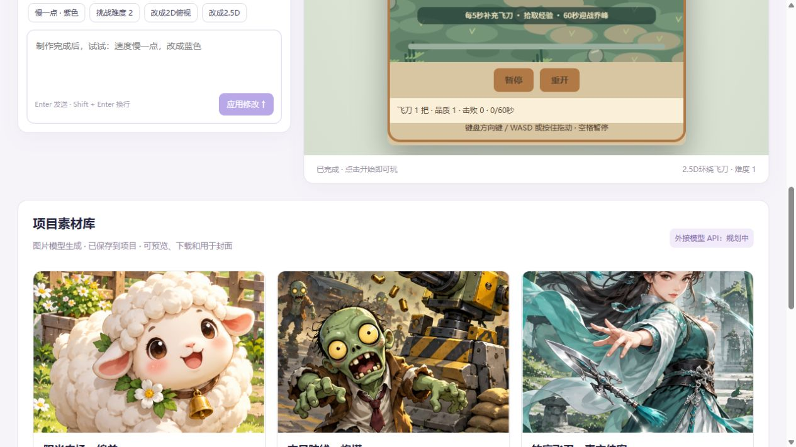

<h1 align="center">🎮 Idea2Game Agent · 创想游</h1>

<p align="center"><b>面向个人创作者的 AI 零代码小游戏平台</b><br><i>把一个游戏想法，变成可以试玩、修改和分享的作品</i></p>

<p align="center">
  
  
  
  
  
</p>

<p align="center"><a href="#features">项目能力</a> · <a href="#demo">在线体验</a> · <a href="#workflow">创作流程</a> · <a href="#stack">技术架构</a> · <a href="#quickstart">快速开始</a></p>

---

<a id="features"></a>

## 💡 项目介绍

**Idea2Game Agent 是面向个人创作者的网页游戏编程 Agent。** 描述角色、规则和操作方式，让AI分析需求、选择生成策略，通过文件工具实现游戏工程；在创作台试玩并继续修改，最后保存作品、下载源码或发布分享。

平台优先支持 **JavaScript、Canvas 与 Three.js**，覆盖轻量2D、2.5D和简单3D游戏。不需要先安装大型游戏引擎，生成的Web产物可以部署到静态网站托管服务。

| 能力 | 你可以怎样使用 |
| --- | --- |
| 🧠 智能游戏生成 | 用自然语言定义玩法，自动路由到HTML、多文件或Vue工程生成方式 |
| 💬 对话与实时预览 | 左侧查看响应和文件操作，右侧直接试玩，在已有工程上持续修改 |
| 🎯 游戏元素定向编辑 | 选中角色、武器、敌人或场景，把稳定对象ID交给修改流程 |
| 🎨 素材与美术管理 | 将公开下载与AI生成的素材保存为项目文件，记录来源并用于预览和导出 |
| 📦 作品保存与分享 | 保存创作状态，下载Web源码工程，将可部署文件分享给朋友试玩 |

<a id="demo"></a>

## 🌐 在线体验

**[打开小游戏创作台 →](https://game-forge-yu-demo.zhuanglaihong.chatgpt.site/)**

选择一个游戏，右侧开始试玩；左侧查看制作过程或修改属性。顶部提供保存、源码下载和分享入口，底部是项目素材库。



> 以上为当前公开版本的真实截图。公开体验使用提前准备的三个案例与制作记录，未连接公网AI后端；支持的属性修改可以实际生效。真实AI生成链路在配置后端和模型后运行，尚需端到端联调。

## ✨ 核心能力
### 描述想法，生成可以玩的游戏

输入角色、操作方式、规则和胜负条件，AI根据复杂度选择单文件HTML、多文件或Vue工程，通过文件工具实现代码，并以流式响应展示生成进展。

> 做一个武侠生存游戏：飞刀围绕角色旋转，敌人从四周追击；击败敌人掉经验，升级可以增加飞刀或提高伤害。

生成目标包括实际玩法、计分、胜负、暂停、重开和手机操作，覆盖休闲益智、消除、动作射击、动作生存等轻量游戏。

### 左边对话，右边试玩，选中对象再修改

在同一个创作台里查看游戏、发现问题并继续描述修改。支持网页界面元素编辑，并增加Canvas对象命中检测与Three.js射线选取。

> 选中飞刀：增加2把，改成金色，转速提高20%。

选中的角色、武器、敌人、卡牌或场景通过稳定对象ID传递给修改流程。Demo支持限定属性调整；正式AI创作台已接入对象信息与生成协议，旧工程需要实现该协议后才能选择画布内部对象。



截图展示实际操作：选中玩家，输入“改成金色，生命改为200”，右侧重新加载修改后的作品。参数会随保存、分享与源码导出保留。

### 保存作品，下载源码，发布分享

试玩满意后保存作品，下载完整工程，或分享链接让朋友直接在浏览器里玩。

支持JavaScript工程ZIP、TypeScript/Vite入口工程ZIP，以及便携单文件HTML。源码包包含运行代码、游戏参数、使用的素材与对应许可说明。浏览器游戏的HTML是入口，JavaScript负责逻辑，Canvas/WebGL负责绘制。

正式平台保留服务器部署与公开资源访问流程。Demo提供Cloudflare可部署文件；自动连接账号、一键发布到Cloudflare仍待接入。

## 🎨 联网素材 + AI美术 + 项目素材库

游戏工程可以使用公开下载的图片与3D模型，也可以使用AI生成的封面、图标和程序化图形。素材保存为项目文件，预览、源码导出和部署使用同一份资源。

- **联网素材**：已有公开素材导入脚本，记录来源、许可、文件大小及SHA256，Demo使用本地GLB模型。
- **AI生成素材**：已有图片模型预生成的封面与农场图案；LLM可以生成SVG及Canvas程序化图形。
- **统一素材库**：可预览、下载素材，并随游戏工程导出。

任意素材自动搜索与用户侧导入、专业美术模型API实时调用、素材版本管理仍待完成。各素材授权以其许可为准。



## 🕹️ 游戏案例

| 游戏 | 类型 | 主要玩法 |
| --- | --- | --- |
| 羊了个羊 | 休闲益智 · 消除游戏 | 多层遮挡、七格暂存、三张消除 |
| 向僵尸开炮 | 动作射击 · 生存防守 | 小队自动射击、数字增援、技能与首领 |
| 武侠大乱斗 | 动作生存 · 肉鸽元素 | 2.5D开放江湖、环绕飞刀、经验与升级 |

创作台支持试玩、查看制作过程、对话参数修改、游戏对象选择、本机保存、源码下载与链接分享。

**当前公开体验未连接公网AI后端。** 三个案例与制作记录已提前准备，对话修改通过限定参数执行，不代表任意创意的实时AI生成已经上线。本机保存属于当前浏览器；分享链接复用已托管游戏与作品参数，并非每个作品单独部署。

<a id="workflow"></a>

## 🔄 创作流程

`描述想法 → 选择生成策略 → 工具写入工程 → 在线试玩 → 选中元素修改 → 保存 / 导出 / 发布`

正式平台以应用和对话记录维护创作上下文；SSE将模型响应与工具反馈传到前端，生成文件由预览入口提供访问。游戏对象选择协议补充画布内实体的编辑上下文，素材使用项目路径，避免依赖模型临时下载地址。

<a id="stack"></a>

## 🛠️ 技术架构

| 层次 | 技术 |
| --- | --- |
| 前端 | Vue 3、TypeScript、Vite、Ant Design Vue、Pinia |
| 后端 | Java 21、Spring Boot 3、MyBatis-Flex、MySQL |
| AI生成 | LangChain4j、LangGraph4j、策略路由、文件工具、对话记忆 |
| 实时反馈 | SSE、Reactor |
| 游戏运行 | JavaScript、Canvas、Three.js |
| 配套服务 | Redis、Caffeine、对象存储、网页截图、Prometheus监控 |

<a id="quickstart"></a>

## ⚡ 快速开始

### 1. 获取项目

```bash
git clone https://github.com/zhuanglaihong/idea2game_agent.git
cd idea2game_agent
```

### 2. 启动游戏创作台

仅运行小游戏创作台不需要Java后端：

```bash
cd yu-ai-code-mother-frontend
npm ci
npm run dev
```

访问终端给出的地址并进入 `/demo`。

### 3. 运行真实AI生成

运行完整AI平台需配置Java 21、MySQL、Redis和模型服务，在本地创建 `application-local.yml`。密钥仅放在后端配置或环境变量中，不提交到仓库。具体配置见[运行说明](GAME_DEMO.md)。

```bash
npm run test:demo
npm run build:demo
npm run build
```

## 📍 当前能力边界

| 功能 | 状态 |
| --- | --- |
| 三款网页游戏、限定对话修改、保存与分享 | 已提供 |
| 游戏对象点选、限定属性修改、源码导出 | 已提供 |
| 正式AI生成、流式反馈、持续修改 | 链路已接入，游戏生成效果待模型联调 |
| 公开素材导入、素材库、预生成美术 | 已提供基础能力 |
| 素材自动搜索、外接美术API、Cloudflare自动发布 | 待完成 |

前端构建与游戏规则测试已通过。当前开发环境未安装Java/Maven，后端及Java包名调整尚未编译验证。

## 📚 文档

- [游戏元素编辑](docs/GAME_ELEMENT_EDITING.md)
- [美术模型与素材库](docs/ART_ASSETS.md)
- [公开游戏素材](docs/PUBLIC_GAME_ASSETS.md)
- [游戏源码格式](docs/GAME_SOURCE_FORMATS.md)
- [开发计划](PLAN.md)

仓库许可证见 [LICENSE](LICENSE)。第三方依赖与素材保留各自的许可文件。
